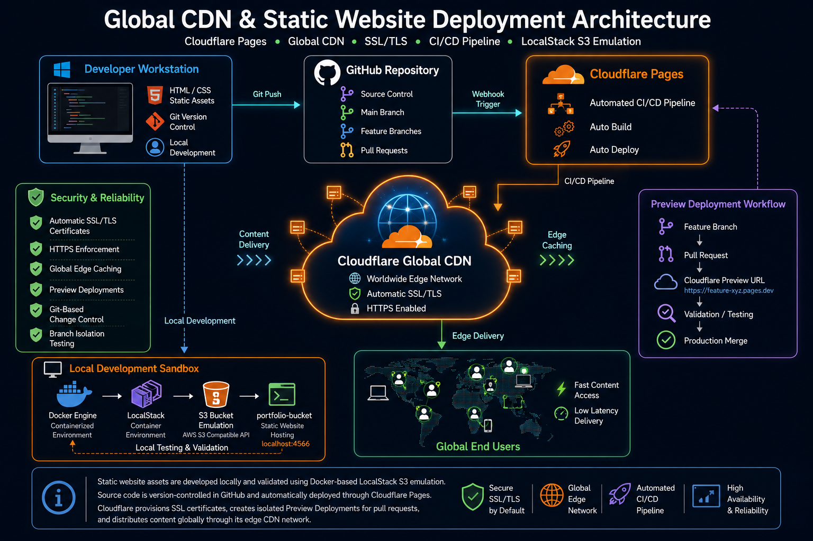

# Comprehensive Deployment Guide: Global CDN, Custom Domain, & Free SSL/TLS

This document provides an end-to-end technical breakdown of **Project 1.1**. It chronicles the step-by-step engineering process of building a static portfolio website, simulating an Enterprise Object Storage infrastructure locally using **LocalStack (AWS S3)**, and deploying a globally distributed live version using **Cloudflare** with a production-ready CI/CD pipeline.

---

## 🏗️ System Architecture & Workflow

1. **Local Development:** Static web assets (`index.html`, `style.css`) managed via Git.
2. **Local Simulation Environment:** Emulating AWS S3 bucket static website hosting using a Docker-based LocalStack container.
3. **Production Deployment:** Automated multi-environment pipeline (Production & Preview branches) managed globally by Cloudflare's Edge CDN.

---

## 🛠️ Step 1: Local Static Website & Git Repository Initialization

### 1. Web Asset Creation

Create a clean directory for your project and instantiate the following foundational frontend source files:

**`index.html`**

```html
<!DOCTYPE html>
<html lang="en">
<head>
    <meta charset="UTF-8">
    <meta name="viewport" content="width=device-width, initial-scale=1.0">
    <title>My Portfolio | Cloud Native Deploy</title>
    <link rel="stylesheet" href="style.css">
</head>
<body>
    <header>
        <h1>Hello, I am a Cloud & DevOps Engineer 👋</h1>
        <p>Project 1.1: Exploring Global CDNs, DNS, SSL, and CI/CD Pipelines</p>
    </header>
    
    <main>
        <section class="card">
            <h2>About This Project</h2>
            <p>This website is deployed using two distinct architectural methodologies to understand modern web hosting infrastructure:</p>
            <ul>
                <li><strong>Cloudflare:</strong> Production environment leveraging a global CDN, automated SSL provisioning, and Git-triggered CI/CD pipelines.</li>
                <li><strong>LocalStack (AWS S3):</strong> Emulated cloud object storage hosting inside a local isolated container network.</li>
            </ul>
        </section>
    </main>

    <footer>
        <p>© 2026 | Engineered with 🔥 for Project 1.1</p>
    </footer>
</body>
</html>

```

**`style.css`**

```css
body {
    font-family: 'Segoe UI', Tahoma, Geneva, Verdana, sans-serif;
    line-height: 1.6;
    margin: 0;
    padding: 0;
    background-color: #f4f7f6;
    color: #333;
}

header {
    background: linear-gradient(135deg, #4f46e5, #06b6d4);
    color: white;
    text-align: center;
    padding: 2rem;
}

main {
    max-width: 800px;
    margin: 2rem auto;
    padding: 0 1rem;
}

.card {
    background: white;
    padding: 2rem;
    border-radius: 8px;
    box-shadow: 0 4px 6px rgba(0,0,0,0.1);
}

ul {
    padding-left: 1.2rem;
}

li {
    margin-bottom: 0.5rem;
}

footer {
    text-align: center;
    padding: 1rem;
    margin-top: 2rem;
    font-size: 0.9rem;
    color: #666;
}

```

### 2. Git Synchronization

Initialize your local git environment, establish a tracking link to your GitHub repository, and commit your source files to the production branch (`main`).

```bash
# Initialize local git repository
git init

# Stage all project files
git add .

# Commit files to local version history
git commit -m "feat: initial commit static website source files"

# Map local repository to your remote GitHub endpoint
git remote add origin https://github.com/YOUR_GITHUB_USERNAME/static-site-deployment.git

# Force default branch renaming to compliance standards
git branch -M main

# Push code assets up to GitHub
git push -u origin main

```

---

## 🐳 Step 2: Simulating AWS S3 Static Website Hosting via LocalStack

### 1. Docker Compose Configuration

To simulate AWS S3 without incurring public cloud charges, instantiate a local cloud orchestration file.

> ⚠️ **Troubleshooting Retrospective:** The default image tag `localstack/localstack:latest` enforces strict licensing checks on newer 2026 builds, crashing with **Exit Code 55 (License activation failed)**. To mitigate this constraint, the configuration uses the stable community release (`3.5.0`).

**`docker-compose.yml`**

```yaml
services:
  localstack:
    container_name: localstack_s3
    image: localstack/localstack:3.5.0
    ports:
      - "127.0.0.1:4566:4566"
    environment:
      - AWS_DEFAULT_REGION=us-east-1
    volumes:
      - "./localstack:/var/lib/localstack"

```

### 2. Launching and Provisioning the Infrastructure

Deploy the container detached from the main terminal interface:

```bash
# Force clear old container volume anomalies and spin up the containerized network
docker-compose down -v
docker-compose up -d --force-recreate

# Verify that the container health check status is stable and active
docker ps

```

### 3. AWS CLI Local Storage Bucket Provisioning

> ⚠️ **Troubleshooting Retrospective:** Executing global commands natively outside your folder scope causes path issues (`path does not exist`). Additionally, the AWS CLI requires mock credential blocks initialized into the environment shell before talking to LocalStack endpoints.

Run the following commands sequentially inside your project directory (`C:\Users\aza\Pictures\static-site-deployment`) via PowerShell:

```powershell
# Injection of Dummy/Mock Credentials into the Active Terminal Env Session
$env:AWS_ACCESS_KEY_ID="test"
$env:AWS_SECRET_ACCESS_KEY="test"
$env:AWS_DEFAULT_REGION="us-east-1"

# Create an S3 Bucket inside the local emulation gateway
aws s3 mb s3://portfolio-bucket --endpoint-url=http://localhost:4566

# Enable Static Web Hosting configurations on the newly created bucket origin
aws s3 website s3://portfolio-bucket/ --index-document index.html --endpoint-url=http://localhost:4566

# Sync and upload the localized code files up to the S3 Target Storage
aws s3 cp index.html s3://portfolio-bucket/ --endpoint-url=http://localhost:4566
aws s3 cp style.css s3://portfolio-bucket/ --endpoint-url=http://localhost:4566

```

### 4. Local Validation Verification

Open a browser session and navigate to your localized bucket web path to confirm rendering success:

```text
http://localhost:4566/portfolio-bucket/index.html

```

---

## ☁️ Step 3: Production Deployment to Cloudflare Global CDN (CI/CD)

### 1. Connecting Git Source to Cloudflare Dashboard

1. Navigate to the **Cloudflare Dashboard** -> **Workers & Pages** -> **Create** -> **Pages**.
2. Grant authentication permission hooks to your GitHub profile and select the remote repository `static-site-deployment`.
3. Set your target active build settings:
* **Framework Preset:** `None`
* **Build Command:** *(Leave entirely blank)*
* **Build Output Directory:** `./` (or default root folder path context).


### 2. Production Pipeline Validation

Cloudflare automatically handles the orchestration framework hookups upon connection, pulling code from `main`, allocating SSL certificates automatically, and binding your application live across its globally distributed edge data networks.

---

## 🔄 Step 4: Feature Testing via Automated Branch Previews

Modern architecture requires structural isolation workflows. We isolate code updates inside a non-production branch, triggering ephemeral isolated testing environments ("Preview URLs") upon submitting an upstream Pull Request.

### 1. Feature Branch Creation and Modifications

```bash
# Branch out into an experimental feature sandbox layer
git checkout -b fitur-update

```

Modify `index.html` to append a visual tracking metric flag:

```html
<p style="color: #4f46e5; font-weight: bold; margin-top: 1rem;">
    ✨ Update: Testing the automated Preview Deployment pipeline!
</p>

```

### 2. Config Manifest Addition for Wrangler Assets

> ⚠️ **Troubleshooting Retrospective:** Modern Cloudflare deployment runtime dependencies check for structural definitions. Omitting it triggers a compilation failure: `[ERROR] Missing entry-point to Worker script or to assets directory`. Creating an empty configuration file throws a secondary `[ERROR] ValueExpected`. A fully formed file specifying the target application type and structural root path context resolves this build blocker.

**`wrangler.jsonc`**

```json
{
  "name": "static-site-cdn",
  "compatibility_date": "2026-06-17",
  "assets": {
    "directory": "./"
  }
}

```

### 3. Pushing the Structural Update Upstream

Commit the configuration manifest modifications and push them to track against GitHub:

```bash
# Check status flags to make sure files are tracked
git status

# Stage and commit the configurations explicitly with content filled
git add wrangler.jsonc index.html
git commit -m "fix: resolve asset entry point error by defining wrangler config"

# Push the dedicated branch to trigger remote CI/CD jobs
git push origin fitur-update

```

### 4. Creating Pull Request and Viewing Preview URL

1. Head over to GitHub and open a **Pull Request (PR)** comparing `fitur-update` into your primary branch `main`.
2. Cloudflare's integrated build bot interceptor hook detects the action, spins up a dynamic compilation runner, and drops an isolated, immutable **Preview URL** straight into the PR comment threads.
3. This setup lets engineers validate visual adjustments live safely without mutating or degrading the stable active production runtime.

---

## 🏁 Architectural Conclusions

| Deployment Vector | Environment Layer | Network Speed | Security Integration | Delivery Infrastructure |
| --- | --- | --- | --- | --- |
| **LocalStack S3 emulation** | Development Sandbox | Internal loopback latency (`localhost`) | Unsecured HTTP bindings | Local container host resources |
| **Cloudflare Platform** | Live Production | Ultra-low Edge caching latency | Automatic Managed HTTPS/TLS | Worldwide distributed Edge proxy arrays |
